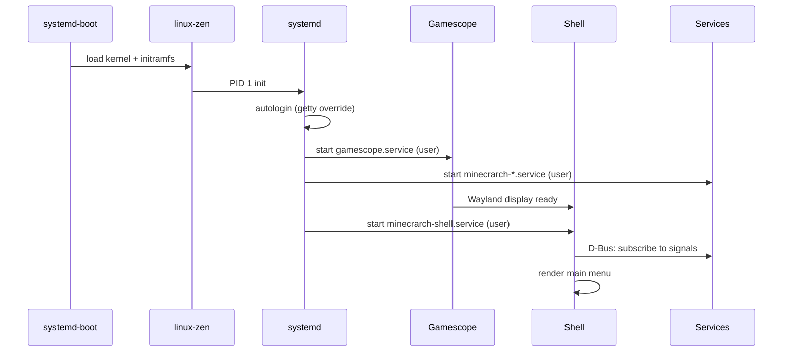
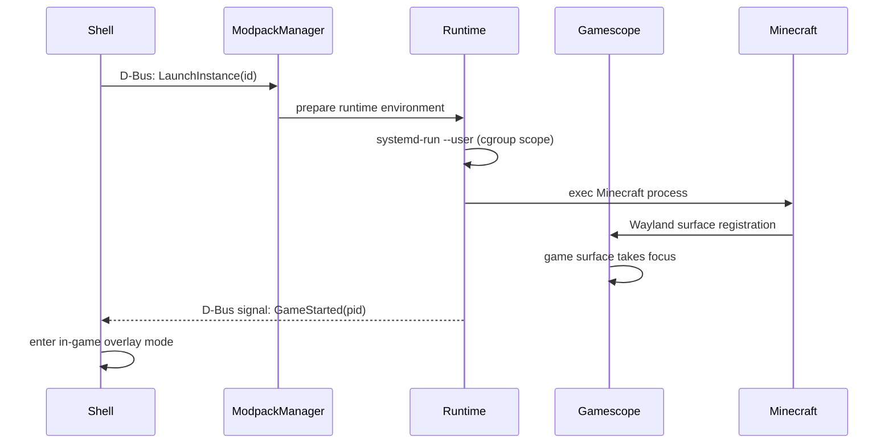
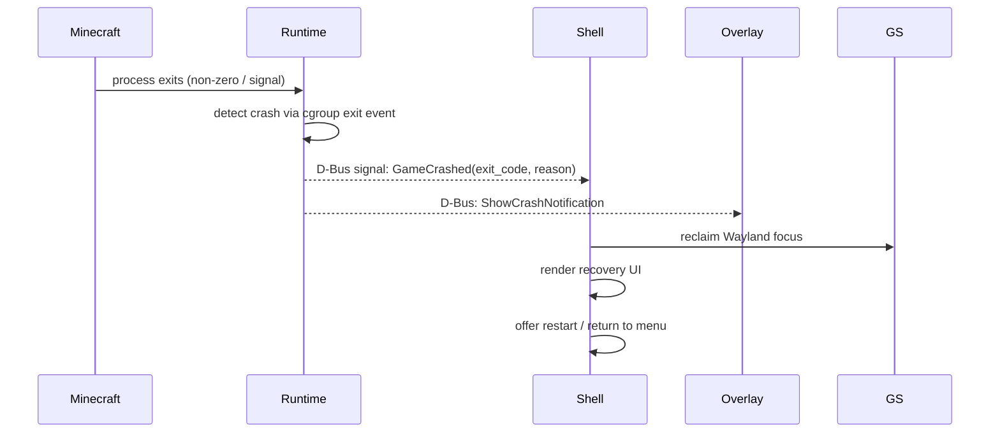

# MinecrarchOS — System Architecture

## Overview

MinecrarchOS is a single-purpose Linux gaming appliance. The system treats Linux as infrastructure and Minecraft as a privileged workload. There is no desktop, no general-purpose application model, and no session manager beyond what the platform itself provides.

The architecture is organized in strict layers. Each layer has one job. Each layer communicates only with adjacent layers.

---

## System Layers

```text
┌─────────────────────────────────────────────────────────────┐
│                         Hardware                            │
└───────────────────────────┬─────────────────────────────────┘
                            │ UEFI
┌───────────────────────────▼─────────────────────────────────┐
│               systemd-boot  (bootloader)                    │
└───────────────────────────┬─────────────────────────────────┘
                            │
┌───────────────────────────▼─────────────────────────────────┐
│                linux-zen  (kernel)                          │
│         Wayland/DRM/KMS · libinput · cgroups v2             │
└───────────────────────────┬─────────────────────────────────┘
                            │
┌───────────────────────────▼─────────────────────────────────┐
│                   systemd  (PID 1)                          │
│      system services · user session · D-Bus daemon          │
└───────┬───────────────────────────────────┬─────────────────┘
        │ autologin                         │ user session bus
┌───────▼───────────┐               ┌───────▼───────────────┐
│  Gamescope        │               │  Runtime Services     │
│  (compositor)     │◄──D-Bus───────│  (background procs)   │
│  Wayland session  │               │  services/            │
└───────┬───────────┘               └───────────────────────┘
        │ Wayland client
┌───────▼───────────┐
│ Minecrarch Shell  │
│ (Rust · GTK4)     │◄──D-Bus──────► Runtime Services
│ shell/            │
└───────┬───────────┘
        │ systemd-run (transient unit)
┌───────▼───────────┐
│  Minecraft        │
│  (Bedrock → Java) │
│  runtime/         │
└───────────────────┘
```

---

## Component Responsibilities

### systemd-boot

Loads linux-zen. Manages boot entries in the ESP. In Phase 3, update and rollback scripts manage boot entries to implement atomic update / rollback behavior.

### linux-zen

The kernel. Provides: DRM/KMS for display, Wayland subsystem for input routing, cgroups v2 for process containment, libinput event processing, and the evdev interface for gamepad input.

### systemd

Manages the full lifecycle of the system and user session. Key roles:
- Launches Gamescope as a systemd user service after autologin.
- Manages the D-Bus user session bus (user session bus).
- Launches and supervises all Runtime Services as user units.
- Provides `systemd-run` for launching Minecraft as a managed transient unit with a cgroup scope.

### Gamescope

The Wayland compositor and session boundary. Owns the display. Manages surface composition, frame pacing, upscaling (FSR/NIS), VRR, and input routing. The Minecrarch Shell and Minecraft both run as Wayland clients within Gamescope's session.

Gamescope is the only component that touches DRM/KMS directly. Nothing above it in the stack does.

### Minecrarch Shell (`shell/`)

The orchestration layer. Implemented in Rust with GTK4 + libadwaita. Runs as a Wayland client inside Gamescope.

**Does:** UX/navigation, session lifecycle management, game launch signaling, overlay management, recovery flow coordination, controller UX, state display.

**Does not:** game launching directly, modpack installation, Java/JVM management, manifest parsing, file downloads. All platform logic is delegated to Runtime Services via D-Bus.

See [ADR-0009](../adr/0009-shell-as-orchestration-layer.md).

### Runtime Services (`services/`)

Long-running background processes managed by systemd user units. Each is an independent D-Bus service on the user session bus.

| Service | Bus Name | Responsibility |
|---|---|---|
| Modpack Manager | `org.minecrarch.ModpackManager` | Instance lifecycle, modpack install/update, Prism Launcher integration |
| Overlay System | `org.minecrarch.Overlay` | HUD overlay rendering above the game surface |
| Logging | `org.minecrarch.Logging` | Structured log collection from all platform components |
| Update Orchestrator | `org.minecrarch.Updater` | Platform package updates, btrfs snapshots, rollback safety |

### Runtime (`runtime/`)

Defines the process model for the Minecraft workload. The game runs as a systemd transient unit (via `systemd-run`) with a cgroup scope for resource management. The runtime layer handles crash detection, process supervision, and recovery signaling back to the shell via D-Bus.

### Minecraft

The privileged workload. Initial target: Bedrock Edition. Long-term: Java Edition with full modded ecosystem support. Runs inside Gamescope's session as a Wayland client (Bedrock) or via a dedicated surface managed by the shell (Java/headless scenarios).

---

## IPC Architecture

All inter-process communication between the shell and services uses D-Bus on the systemd user session bus.

```text
Minecrarch Shell (zbus client)
        │
        │   D-Bus user session bus
        │   ─────────────────────────────────────────────────
        ├──► org.minecrarch.ModpackManager   (method calls)
        │◄── org.minecrarch.ModpackManager   (signals: InstanceReady, InstallFailed, ...)
        │
        ├──► org.minecrarch.Overlay          (method calls: ShowNotification, ...)
        │
        ├──► org.minecrarch.Updater          (method calls: CheckUpdate, ApplyUpdate, ...)
        │◄── org.minecrarch.Updater          (signals: UpdateAvailable, UpdateApplied, ...)
        │
        └──► org.minecrarch.Logging          (method calls: SetLogLevel, ...)
```

- **Method calls**: shell → service, synchronous request/response.
- **Signals**: service → shell, async push notifications. The shell subscribes to signals on startup.
- **Properties**: service-maintained state (e.g., download progress) that the shell can read via D-Bus properties; high-frequency state should be read this way rather than emitted as signals.

See [ADR-0012](../adr/0012-ipc-mechanism.md) and `docs/ipc.md` (planned).

---

## Session Lifecycle

### Normal boot



### Game launch



### Game crash recovery



---

## Filesystem Layout (Planned)

```text
/
├── @                    (btrfs root subvolume)
│   ├── boot/            (ESP mountpoint — systemd-boot entries, vmlinuz-linux-zen)
│   ├── usr/             (system packages — managed by pacman)
│   ├── etc/             (system config)
│   └── var/             (system state)
├── @home                (btrfs home subvolume)
│   └── minecrarch/      (platform user home)
│       ├── .local/share/PrismLauncher/    (Prism instances)
│       └── .local/share/minecrarch/       (platform state)
└── @snapshots           (btrfs snapshot subvolume — Phase 3)
```

The subvolume layout separates system state from user data, enabling targeted snapshots. A system update snapshots `@` before applying changes; user data in `@home` is preserved across rollbacks.

---

## Key Architectural Invariants

These must not be violated by any implementation decision:

1. **Gamescope owns the display.** No component writes to DRM/KMS except Gamescope.
2. **The shell is stateless with respect to platform logic.** All persistent state (instances, modpacks, settings, logs) is owned by `services/` or the filesystem. The shell only displays and signals.
3. **Services are independent.** A service crash must not crash the shell. Each service has a systemd `Restart=` policy.
4. **Game process is a cgroup scope.** Minecraft always runs as a systemd transient unit. Never exec directly from the shell or a service without `systemd-run`.
5. **All UI is gamepad-navigable.** No interactive element is mouse-only or keyboard-only.
6. **Service interfaces are contracts.** The D-Bus XML interface for each service is the formal boundary. Implementations may change; the interface must be versioned.
7. **Prism Launcher is replaceable.** All Prism-specific code is bounded within `services/` behind the `ModpackManager` D-Bus interface.

---

## Related Documents

- [ADR Index](../adr/README.md) — rationale for all architectural decisions
- [`docs/skills.md`](../skills.md) — per-component technical context for working on each area
- [`docs/session-model.md`](../session-model.md) — full session state machine, Wayland strategy, suspend/resume, recovery flows
- [`docs/runtime.md`](../runtime.md) — Minecraft runtime process model, cgroup topology, supervision
- [`docs/ipc.md`](../ipc.md) — D-Bus interface contracts for all services
