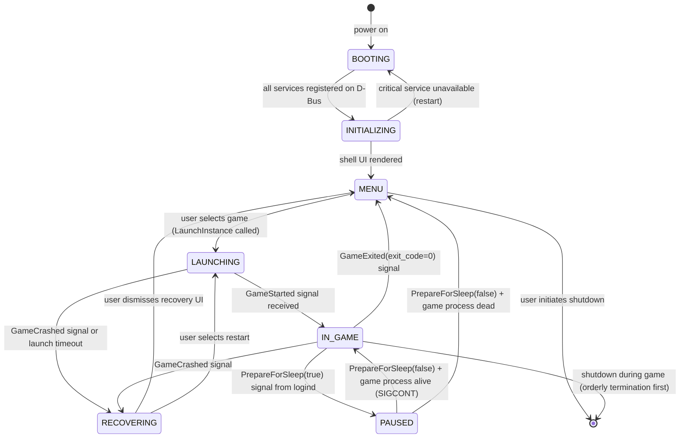
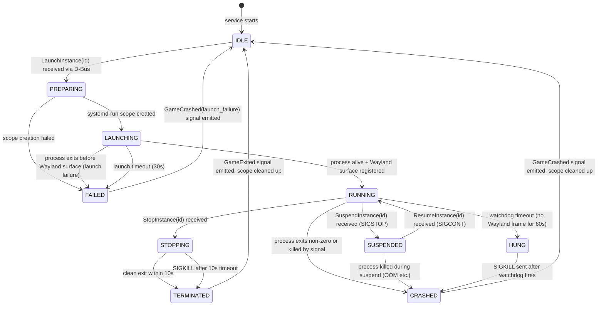
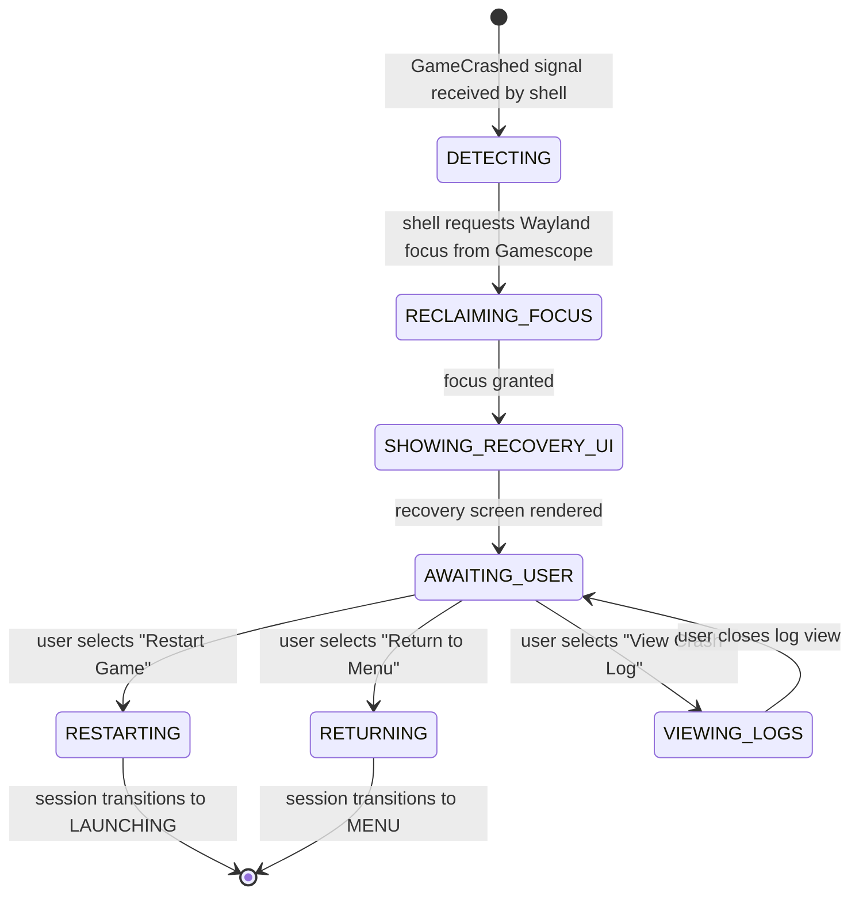
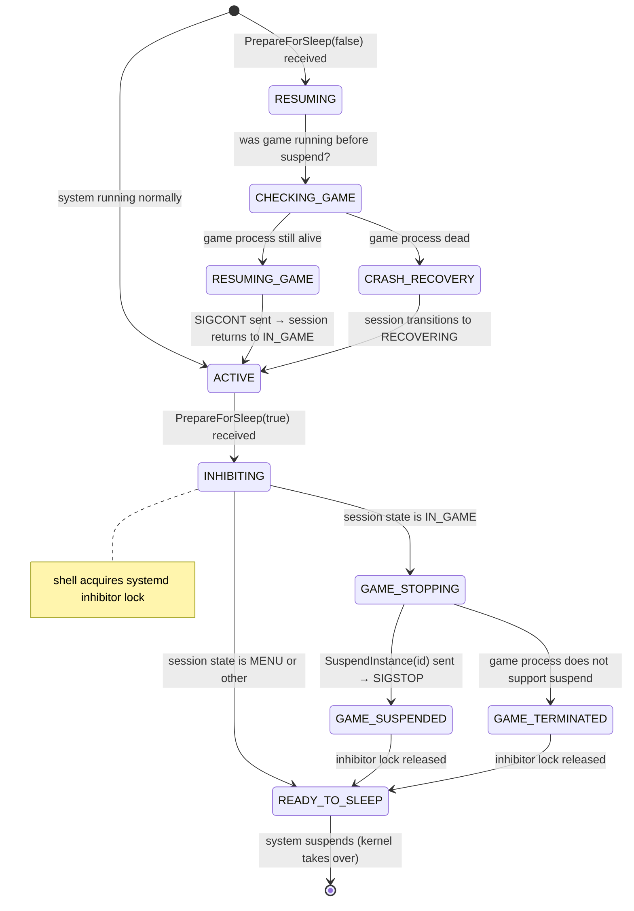
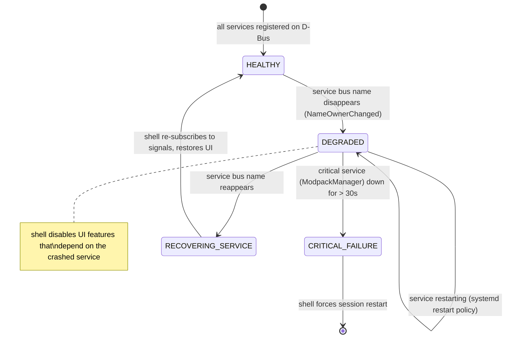
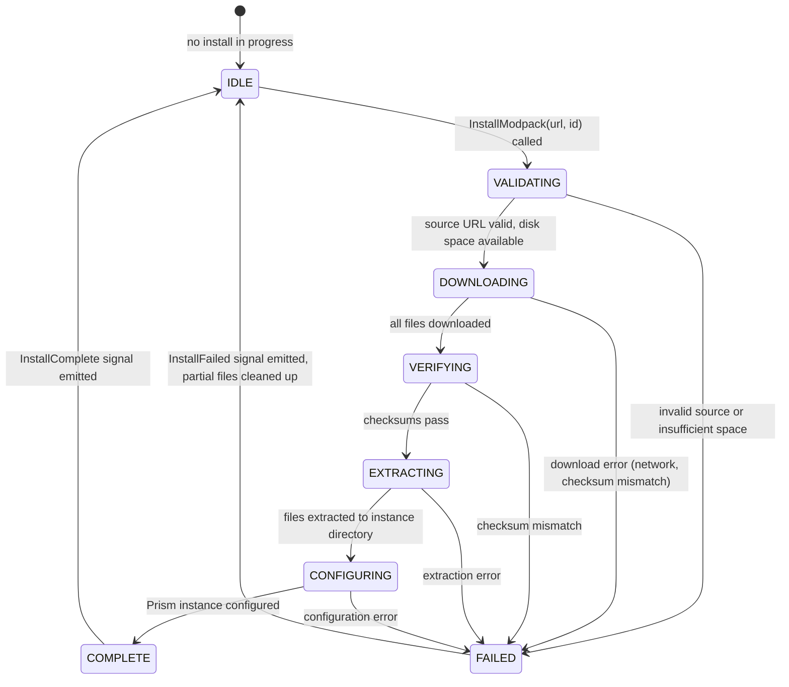

# MinecrarchOS — State Machines

These are the canonical state machine definitions for all major runtime flows. Implementation must conform to these diagrams. Any deviation requires an ADR.

---

## 1. Session Lifecycle

The top-level state of the platform from boot to shutdown.

**State ownership:** Minecrarch Shell holds and transitions the session state. Services report events; the shell decides transitions.

---

## 2. Game Process Lifecycle

The lifecycle of a single Minecraft process instance, managed by the runtime layer.

**State ownership:** `services/modpack-manager` owns game process state. The runtime layer supervises the process; the service translates process events to D-Bus signals.

**Exit signals emitted:**

| Terminal state | D-Bus signal |
|---|---|
| `TERMINATED` (exit 0) | `GameExited(id, 0)` |
| `CRASHED` (non-zero exit) | `GameCrashed(id, exit_code, signal_name)` |
| `CRASHED` (OOM) | `GameCrashed(id, -1, "OOM")` |
| `CRASHED` (hung) | `GameCrashed(id, -1, "WATCHDOG")` |
| `FAILED` (launch) | `GameCrashed(id, -1, "LAUNCH_FAILURE")` |

---

## 3. Crash Recovery Flow

The recovery flow from `RECOVERING` session state back to a stable state.

**Invariant:** The shell must regain Wayland focus before rendering recovery UI. If Gamescope does not release focus within 2s, the shell logs the failure and forces a session restart.

---

## 4. Suspend/Resume Flow

**Invariant:** The inhibitor lock is always released before returning from the INHIBITING state, regardless of what happens to the game process. A failed SIGSTOP must not block system suspend.

---

## 5. Service Degradation

When a non-critical runtime service crashes and restarts.

**Critical services:** `org.minecrarch.ModpackManager`, `org.minecrarch.Logging`
**Non-critical services:** `org.minecrarch.Overlay`, `org.minecrarch.Updater`

The shell must never crash because a service crashed. Service failure is an expected operational event, not an exception.

---

## 6. Modpack Install Flow

**Progress signals:** `InstallProgress(id, percent, stage, bytes_done, bytes_total)` emitted at max 2/s during DOWNLOADING and EXTRACTING stages.

**Invariant:** On FAILED, all partially-written files must be removed. The instance directory must either be complete and valid, or absent. No partial state.

---

## Diagram Maintenance

When a state machine changes due to new requirements or implementation discoveries:

1. Update the diagram in this file first.
2. Update the corresponding prose in `docs/session-model.md` or `docs/runtime.md`.
3. Reference this file in the PR description.
4. If the change affects an Accepted ADR, open a new ADR.

The diagrams in this file are authoritative. Implementation that diverges from them is a bug, not the diagram.
